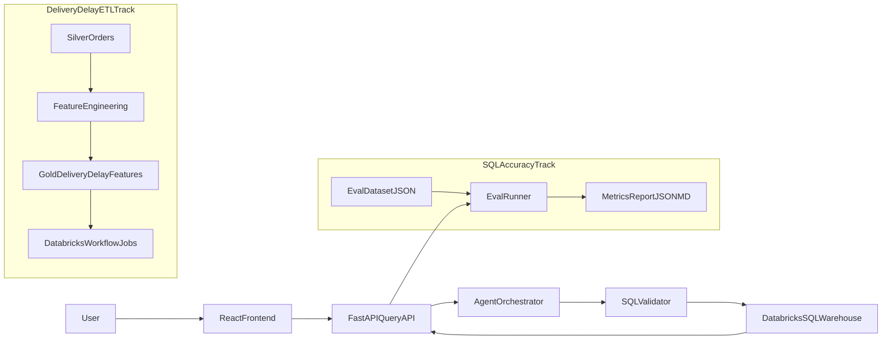

# Kế hoạch Phase 2 hoàn chỉnh

Tài liệu này chốt phạm vi triển khai giai đoạn 2 cho dự án AI Agent - Smart Data Analyst, bám sát codebase hiện tại để đội có thể triển khai ngay, đo được kết quả, và chứng minh với giảng viên bằng số liệu.

## 1. Mục tiêu giai đoạn 2

1. Đánh giá định lượng chất lượng SQL do AI sinh ra thay vì đánh giá cảm tính.
2. Xây ETL trên Databricks để tạo bảng đặc trưng cho bài toán dự đoán giao trễ.
3. Nâng frontend từ Streamlit sang React nhưng giữ tương thích API backend hiện tại.
4. Cải tiến prompt theo vòng lặp benchmark để tăng độ chính xác thực tế.

## 2. Hiện trạng và định hướng áp dụng

- Backend đã có pipeline end-to-end trong `backend/services/agent_service.py`: router, sinh SQL, validate, sanitize, execute, chart recommendation, NLG.
- Chính sách read-only và giới hạn LIMIT đã có ở `backend/utils/sql_validator.py`.
- Prompt đã có domain rules + few-shot ở `backend/prompts/system_prompt.txt`.
- API đã sẵn cho cả query thường và query stream ở `backend/routers/query.py`.
- Frontend Streamlit đang hoạt động ổn (`frontend/app.py`), có thể làm baseline UX trước khi migrate React.

## 3. Kiến trúc thực thi Phase 2

## 4. Workstream A - SQL Accuracy Evaluation

### Mục tiêu đo lường
- ExecutionSuccessRate >= 90%
- SafetyPassRate = 100%
- SemanticMatchRate >= 80%
- OverallWeightedScore >= 85%

### Công nghệ áp dụng
- Python evaluation runner
- Pytest cho regression tests
- Databricks SQL Connector để chạy cả generated SQL và gold SQL
- JSON/Markdown report cho nộp báo cáo

### Cách triển khai
1. Tạo bộ `eval_dataset.json` gồm 80-120 câu hỏi chia nhóm: basic select, aggregate, join, time filter, realtime, edge cases.
2. Mỗi mẫu có cấu trúc: `id`, `question`, `gold_sql`, `category`, `difficulty`, `must_include`, `must_exclude`.
3. Runner gọi API hoặc `process_question()` để lấy `generated_sql`.
4. Chấm điểm theo 4 trục:
   - SyntaxPass
   - SafetyPass
   - PerformancePass
   - SemanticScore (so sánh shape + key metrics với gold SQL)
5. Xuất `eval_report.json` và `eval_report.md` để so baseline và sau cải tiến prompt.

## 5. Workstream B - ETL dự đoán giao trễ trên Databricks

### Bảng nguồn
- `olist_orders`
- `olist_order_items`
- `olist_customers`
- `olist_sellers`

### Thiết kế pipeline
1. Silver layer:
   - Chuẩn hóa timestamp, lọc bản ghi không hợp lệ.
   - Giữ các cột cần cho modeling và kiểm tra null rate.
2. Feature layer:
   - Label: `is_delayed = order_delivered_customer_date > order_estimated_delivery_date`.
   - Features: `delivery_days`, `estimated_days`, `delay_days`, `is_weekend_purchase`, `item_count`, `total_freight`, `avg_item_price`, `customer_state`, `seller_state`.
3. Gold layer:
   - Ghi vào `ai_analyst.ecommerce.gold_delivery_delay_features`.
4. Scheduling:
   - Databricks Workflow chạy hàng ngày.
   - Ghi metadata run: `run_id`, `ingest_ts`, `row_count`, `dq_status`.

### Data quality checks bắt buộc
- Null rate cột trọng yếu < 5%
- `is_delayed` chỉ nhận 0/1
- Bản ghi delivered phải có logic thời gian hợp lệ

## 6. Workstream C - Frontend React migration

### Mục tiêu
- Đưa UI sang React.

### Công nghệ áp dụng
- React + Vite + TypeScript
- Axios client cho REST
- Render chart với Recharts
- Cơ chế stream progress tương thích endpoint `/api/v1/chat/query/stream`

### Lộ trình migration
1. Milestone C1:
   - Dựng khung React app, kết nối `POST /api/v1/chat/query`, hiển thị answer/sql/table.
2. Milestone C2:
   - Thêm chart renderer theo `visualization_recommendation.chart_type`.
3. Milestone C3:
   - Tích hợp stream progress theo các step backend đang trả.
4. Milestone C4:
   - Hoàn thiện conversation history, retry UI, error state.
5. Milestone C5:
   - Cập nhật docker-compose để chạy song song React và backend.

## 7. Workstream D - Prompt improvement loop

### Mục tiêu
- Tối ưu prompt có kiểm chứng bằng benchmark, không chỉnh theo cảm giác.

### Cách áp dụng
1. Version hóa prompt: `v1_baseline`, `v2_rule_refined`, `v3_fewshot_refined`.
2. Mỗi vòng lặp:
   - Chạy benchmark.
   - Lọc top nhóm lỗi (sai bảng, sai join, sai thời gian, sai realtime table).
   - Cập nhật prompt/rules có mục tiêu.
   - Chạy benchmark lại và ghi chênh lệch metrics.
3. Không dùng chain-of-thought hiển thị ra output cuối; chỉ giữ output SQL sạch như contract hiện tại.

## 8. Definition of Done

- SQL accuracy có report baseline và final, tái chạy được.
- ETL có notebook, có bảng gold, job schedule chạy ổn định.
- React frontend xử lý được query, hiển thị answer/sql/table/chart và lỗi.
- Prompt có changelog theo version và chứng minh metric tăng.

## 9. Rủi ro và phương án xử lý

- Rủi ro semantic scoring không ổn định: ưu tiên execution-based metrics.
- Rủi ro stream integration trên browser: fallback non-stream flow.
- Rủi ro dữ liệu thiếu cho ETL: quality gate + imputation có kiểm soát.
- Rủi ro overfit vào eval set: tách holdout set riêng.

## 10. Deliverables nộp giảng viên

- Kế hoạch triển khai Phase 2 đã cập nhật.
- Báo cáo SQL evaluation (baseline vs final).
- ETL notebook và bằng chứng Databricks Workflow runs.
- Frontend React demo E2E với backend hiện tại.
- Prompt changelog và bảng so sánh metric trước/sau.
