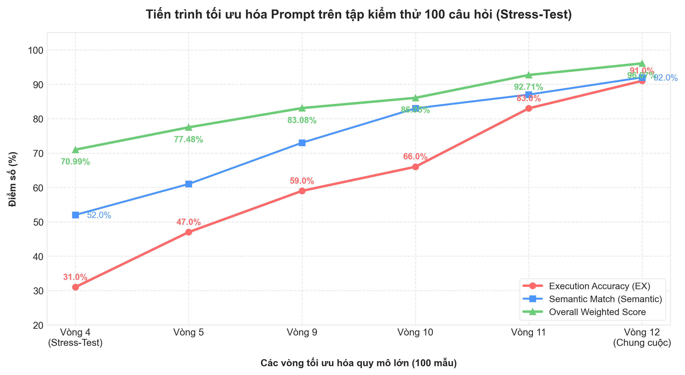

<h1 align="center">🤖 AI Agent — Smart Data Analyst</h1>

<p align="center">
  <strong>Trợ lý phân tích dữ liệu thông minh sử dụng kiến trúc Multi-Agent</strong><br>
  Chuyển đổi câu hỏi ngôn ngữ tự nhiên (Việt/Anh) thành truy vấn SQL, thực thi trên Databricks và trả về kết quả trực quan.
</p>

<p align="center">
  <a href="#-tính-năng-chính">Tính năng</a> •
  <a href="#-kiến-trúc-hệ-thống">Kiến trúc</a> •
  <a href="#-đánh-giá-benchmark">Benchmark</a> •
  <a href="#-tech-stack">Tech Stack</a> •
  <a href="#-cài-đặt">Cài đặt</a> •
  <a href="#-api-reference">API</a> 
  
</p>

<p align="center">
  
  
  
  
  
  
</p>


<a id="-tính-năng-chính"></a>
## ✨ Tính năng chính

| Tính năng | Mô tả |
|---|---|
| 🗣️ **Natural Language to SQL** | Đặt câu hỏi bằng tiếng Việt/Anh, AI tự sinh SQL Spark chính xác |
| 🤖 **Multi-Agent Orchestration** | 5 Agent chuyên biệt phối hợp qua LangGraph workflow |
| 📊 **Auto Visualization** | Tự động đề xuất biểu đồ phù hợp (Bar, Line, Pie, Area, Scatter) |
| 💬 **NLG Response** | Diễn giải kết quả bằng ngôn ngữ tự nhiên, không cần đọc bảng thô |
| ⚡ **Real-time Streaming** | Progress tracking từng bước qua Server-Sent Events (SSE) |
| 🔒 **SQL Safety** | Validate & sanitize SQL trước khi thực thi, chặn mọi thao tác ghi/xóa |
| 📥 **Export CSV** | Xuất kết quả truy vấn ra file CSV |
| 💾 **Session Persistence** | Lưu lịch sử hội thoại tự động, không mất khi refresh trang |

---

<a id="-kiến-trúc-hệ-thống"></a>
## 🏗 Kiến trúc hệ thống

### Tổng quan


### Multi-Agent Pipeline


### Các Agent

| # | Agent | File | Chức năng |
|---|---|---|---|
| 1 | **Router** | `router_agent.py` | Phân loại intent: `conversation` / `sql` / `visualize`. Dùng LLM scoring + fallback keyword rule-based |
| 2 | **Conversation** | `conversation_agent.py` | Trả lời chào hỏi, hội thoại chung. Fallback khi SQL pipeline lỗi |
| 3 | **SQL** | `agent_service.py` | Sinh SQL Spark từ NL, thực thi Databricks, retry self-correction (tối đa 3 lần) |
| 4 | **Visualize** | `visualize_agent.py` | Đề xuất chart spec (`chart_type`, `x`, `y`, `title`). Heuristic-first, LLM fallback |
| 5 | **NLG** | `nlg_agent.py` | Diễn giải kết quả thành câu trả lời tự nhiên, giữ đúng số liệu |

---

<a id="-đánh-giá-benchmark"></a>
## 📈 Đánh giá (Benchmark)

Hệ thống được đánh giá trên **100 test cases** phức tạp với 4 chỉ số chuẩn trích từ nghiên cứu khảo sát toàn diện *"From Natural Language to SQL"* (Mohammadjafari et al., 2024):

### 1. Chỉ số hiệu năng
| Chỉ số | Kết quả | Mô tả |
|---|---|---|
| **EX** (Execution Accuracy) ⭐ | **91.0%** | Tỷ lệ SQL sinh ra trả về kết quả khớp hoàn toàn với Gold SQL khi thực thi trên Databricks |
| **CM** (Component Match) | **91.5%** | Tỷ lệ các mệnh đề SQL (SELECT, WHERE, JOIN...) khớp chính xác cấu trúc |
| **EM** (Exact Match) | **50.0%** | Tỷ lệ khớp từng ký tự chuỗi SQL (rất khắt khe do khác biệt alias/formatting) |
| **VES** (Valid Efficiency Score) | **90.4%** | Hiệu năng thực thi (tốc độ chạy query) so với phương án tối ưu của Gold SQL |

**Chỉ số bổ sung:**
* 🟢 **Syntax Pass Rate:** **100%** (Không có câu lệnh nào lỗi cú pháp)
* 🔵 **Semantic Match Rate:** **92.0%** (AI hiểu đúng ý định nghiệp vụ và chọn đúng bảng/cột ngữ cảnh)
* 🏆 **Overall Weighted Score:** **96.07%** (Điểm tổng hợp chất lượng toàn diện của hệ thống)

---

### 2. Tiến trình tối ưu hóa qua 12 Vòng (Prompt Tuning Loop)
Để đạt được độ chính xác vượt trội, prompt của hệ thống đã được cải tiến liên tục qua **12 vòng lặp kiểm thử và tinh chỉnh**:
* **Vòng tinh chỉnh nhanh (20 mẫu):** Dùng để debug nhanh các quy tắc định danh (Alias), giới hạn (`LIMIT`), và lỗi logic cơ bản.
* **Vòng Stress-Test diện rộng (100 mẫu):** Đánh giá toàn diện trên toàn bộ bộ dataset để đảm bảo tính bao quát, chống Overfitting trước khi đóng băng mã nguồn.

#### Biểu đồ tiến trình tối ưu hóa (Tính trên tập Test 100 mẫu):



> 📁 Chi tiết lịch sử phân tích lỗi và nhật ký hành động của từng vòng: [`evaluation/prompt_fix_log.md`](backend/evaluation/prompt_fix_log.md)

---

<a id="-tech-stack"></a>
## 🛠 Tech Stack

### Backend
| Công nghệ | Phiên bản | Vai trò |
|---|---|---|
| Python | 3.10+ | Runtime |
| FastAPI | 0.115 | Web framework + SSE |
| LangChain | 0.3.0 | SQL chain + LLM orchestration |
| LangGraph | latest | Multi-agent workflow |
| Gemini | gemini-3.1-flash-lite | LLM provider (default) |
| Databricks SQL | Connector 3.6 | Data warehouse |
| SQLAlchemy | 2.0.35 | Database abstraction |

### Frontend
| Công nghệ | Phiên bản | Vai trò |
|---|---|---|
| React | 19 | UI framework |
| Vite | 8 | Build tool |
| TypeScript | 6.0 | Type safety |
| Zustand | 5.0 | State management + persistence |
| Recharts | 3.8 | Chart rendering |
| TailwindCSS | 3.4 | Styling |
| Nginx | latest | Production static server + reverse proxy |

### Infrastructure
| Công nghệ | Vai trò |
|---|---|
| Docker Compose | Container orchestration |
| Databricks Unity Catalog | Data governance |
| Olist E-Commerce Dataset | 10 tables, ~100K orders |


---

<a id="-cài-đặt"></a>
## 🚀 Cài đặt

### Yêu cầu

- Docker & Docker Compose (khuyến nghị)
- Hoặc: Python 3.10+ & Node.js 18+
- Databricks workspace với SQL Warehouse
- Gemini API key (hoặc OpenAI API key)

### Cách 1: Docker Compose (khuyến nghị)

**Bước 1:** Cấu hình biến môi trường

```bash
cp .env.example backend/.env
# Mở backend/.env và điền credentials thật
```

**Bước 2:** Khởi chạy hệ thống

```bash
docker compose up --build
```

**Bước 3:** Truy cập

| Service | URL |
|---|---|
| 🌐 Frontend | http://localhost |
| ⚙️ Backend API | http://localhost:8000 |
| 📖 API Docs (Swagger) | http://localhost:8000/docs |

### Cách 2: Dev Mode (local)

**Backend:**

```bash
cd backend
python3 -m venv .venv && source .venv/bin/activate
pip install -r requirements.txt
uvicorn main:app --reload --port 8000
```

**Frontend:**

```bash
cd frontend-react
npm install
npm run dev
# → http://localhost:5173
```

---

## 🔑 Biến môi trường

| Biến | Mô tả | Bắt buộc |
|---|---|---|
| `DATABRICKS_HOST` | Hostname workspace Databricks | ✅ |
| `DATABRICKS_HTTP_PATH` | HTTP path của SQL Warehouse | ✅ |
| `DATABRICKS_CLIENT_ID` | Service Principal Application ID | ✅* |
| `DATABRICKS_CLIENT_SECRET` | Service Principal OAuth Secret | ✅* |
| `DATABRICKS_CATALOG` | Unity Catalog name | ✅ |
| `DATABRICKS_SCHEMA` | Schema chứa tables | ✅ |
| `LLM_PROVIDER` | `gemini` hoặc `openai` | ✅ |
| `GEMINI_API_KEY` | Google Gemini API key | ✅** |
| `GEMINI_MODEL` | Model name (default: `gemini-3.1-flash-lite`) | |
| `SQL_MAX_LIMIT` | Max rows per query (default: 1000) | |

> \* Hoặc dùng `DATABRICKS_TOKEN` (Personal Access Token) thay cho Service Principal  
> \** Bắt buộc khi `LLM_PROVIDER=gemini`

---

<a id="-api-reference"></a>
## 📡 API Reference

### Health & Schema

| Method | Endpoint | Mô tả |
|---|---|---|
| `GET` | `/api/v1/health` | Health check (lightweight) |
| `GET` | `/api/v1/health?deep=true` | Deep health check (test LLM connection) |
| `GET` | `/api/v1/schema` | Lấy thông tin schema Databricks |

### Chat & Query

| Method | Endpoint | Mô tả |
|---|---|---|
| `POST` | `/api/v1/chat/query` | Truy vấn đồng bộ (JSON response) |
| `POST` | `/api/v1/chat/query/stream` | Truy vấn streaming (SSE real-time) |
| `POST` | `/api/v1/chat/route` | Chỉ phân loại intent (không thực thi) |

**Request body:**

```json
{
  "question": "Top 5 thành phố có nhiều khách hàng nhất?"
}
```

**Response format:**

```json
{
  "question": "Top 5 thành phố có nhiều khách hàng nhất?",
  "current_agent": "sql",
  "routing_info": {
    "intent": "sql",
    "scores": {
      "conversation": 0,
      "visualize": 0.1,
      "sql": 0.9
    },
    "selected_agents": [
      "sql"
    ],
    "routing_method": "llm"
  },
  "answer": "Chào bạn, dưới đây là 5 thành phố có số lượng khách hàng lớn nhất:\n\n1. **Sao Paulo (SP)**: 14.984 khách hàng\n2. **Rio de Janeiro (RJ)**: 6.620 khách hàng\n3. **Belo Horizonte (MG)**: 2.672 khách hàng\n4. **Brasilia (DF)**: 2.069 khách hàng\n5. **Curitiba (PR)**: 1.465 khách hàng\n\nHy vọng thông tin này hữu ích với bạn!",
  "generated_sql": "SELECT c.customer_city, c.customer_state, COUNT(DISTINCT c.customer_unique_id) AS total_customers\nFROM olist_customers c\nGROUP BY c.customer_city, c.customer_state\nORDER BY total_customers DESC\nLIMIT 5",
  "data": [
    {
      "customer_city": "sao paulo",
      "customer_state": "SP",
      "total_customers": 14984
    },
    {
      "customer_city": "rio de janeiro",
      "customer_state": "RJ",
      "total_customers": 6620
    },
    {
      "customer_city": "belo horizonte",
      "customer_state": "MG",
      "total_customers": 2672
    },
    {
      "customer_city": "brasilia",
      "customer_state": "DF",
      "total_customers": 2069
    },
    {
      "customer_city": "curitiba",
      "customer_state": "PR",
      "total_customers": 1465
    }
  ],
  "row_count": 5,
  "visualization_recommendation": {
    "chart_type": "bar",
    "x": "customer_city",
    "y": "total_customers",
    "title": "Top 5 thành phố có nhiều khách hàng nhất",
    "reason": "User explicitly requested chart type",
    "routed_agent": "sql"
  },
  "error": null
}
```


---

<a id="-bảo-mật"></a>
## 🛡 Bảo mật

- **Read-only policy**: Chặn mọi yêu cầu `INSERT`, `UPDATE`, `DELETE`, `DROP` ở cả 2 tầng (NL detection + SQL validation)
- **SQL Sanitize**: Loại bỏ comments, nested queries nguy hiểm, giới hạn `LIMIT`
- **No credentials in code**: Tất cả secrets qua biến môi trường (`.env`)
- **CORS configurable**: Có thể restrict origins trong production

---

<a id="-cấu-trúc-dự-án"></a>
## 📁 Cấu trúc dự án

```
ai-agent-data-analyst/
├── backend/                          # FastAPI Backend
│   ├── main.py                       # Entry point, CORS, startup warm-up
│   ├── config.py                     # Databricks / LLM / App config
│   ├── requirements.txt              # Python dependencies
│   ├── Dockerfile
│   ├── routers/
│   │   ├── health.py                 # GET /health, /schema
│   │   └── query.py                  # POST /chat/query, /chat/query/stream
│   ├── services/
│   │   ├── agent_service.py          # Multi-Agent Orchestrator (LangGraph)
│   │   ├── router_agent.py           # Intent classification
│   │   ├── conversation_agent.py     # Conversation handler
│   │   ├── visualize_agent.py        # Chart recommendation
│   │   ├── nlg_agent.py              # Natural language generation
│   │   ├── llm_service.py            # LLM provider factory (Gemini/OpenAI)
│   │   ├── query_result_parser.py    # Raw result → JSON parser
│   │   └── schema_service.py         # Schema introspection
│   ├── prompts/
│   │   └── system_prompt.txt         # System prompt (27 rules + few-shot examples)
│   ├── utils/
│   │   ├── sql_validator.py          # SQL safety: validate, sanitize, block writes
│   │   └── logger.py                 # Structured logging
│   └── evaluation/                   # Benchmark & Evaluation module
│       ├── sql_eval_runner.py        # Evaluation runner
│       ├── text_to_sql_metrics.py    # CM, EM, EX, VES metrics
│       ├── eval_dataset.json         # 100 test cases (gold SQL)
│       ├── prompt_fix_log.md         # Optimization history (12 rounds)
│       └── reports/                  # Auto-generated evaluation reports
│
├── frontend-react/                   # React 19 + Vite Frontend
│   ├── src/
│   │   ├── App.tsx                   # Root layout (Sidebar + Chat)
│   │   ├── components/
│   │   │   ├── chat/
│   │   │   │   ├── ChatWindow.tsx    # Message list + auto-scroll
│   │   │   │   ├── ChatInput.tsx     # Input bar + message queue
│   │   │   │   └── MessageBubble.tsx # User/AI message renderer
│   │   │   ├── charts/
│   │   │   │   └── DynamicChart.tsx  # Recharts renderer (6 chart types)
│   │   │   └── shared/
│   │   │       ├── Sidebar.tsx       # Session history + grouped by date
│   │   │       ├── DataTable.tsx     # Paginated result table + CSV export
│   │   │       └── SQLViewer.tsx     # Syntax-highlighted SQL viewer
│   │   ├── hooks/
│   │   │   └── useChatStream.ts      # SSE stream handler + task queue
│   │   ├── store/
│   │   │   └── chatStore.ts          # Zustand store + auto-persist sessions
│   │   ├── api/
│   │   │   └── config.ts             # API base URL config
│   │   └── types/                    # TypeScript type definitions
│   ├── Dockerfile                    # Multi-stage: build → nginx
│   ├── nginx.conf                    # Reverse proxy → backend
│   └── package.json
│
├── docs/                             # Team documentation
├── docker-compose.yml                # Full-stack deployment
├── .env.example                      # Environment template
└── README.md
```

---

<p align="center">
  <sub>Built with ❤️ using LangChain + Databricks + React</sub>
</p>
